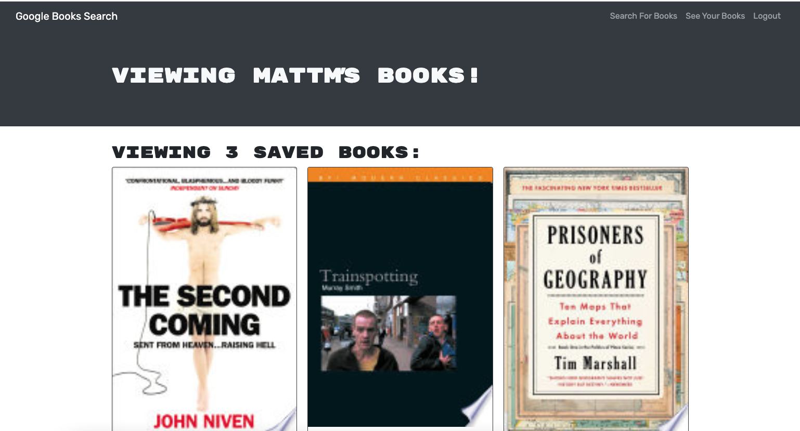

# book-search-engine

## Description

A MERN stack application using graphql to allow users to log in or sign up and search for books from Google books API. The user can save books and view their saved books. Deployed application:

## Table of Contents

- [Installation](#installation)
- [Usage](#usage)
- [License](#license)
- [Contributing](#contributing)
- [Tests](#tests)
- [Questions](#questions)

## Installation

npm i

## Usage

clone locally and install dependencies.

## License

https://opensource.org/licenses/MIT
This project is under the license of MIT

## Contributing

to contribute please get in touch

## Tests

no tests

## Questions

If you have any questions about this project, you can contact me at matthewmckenna1986@hotmail.com. More projects available here https://github.com/mattmc86.
